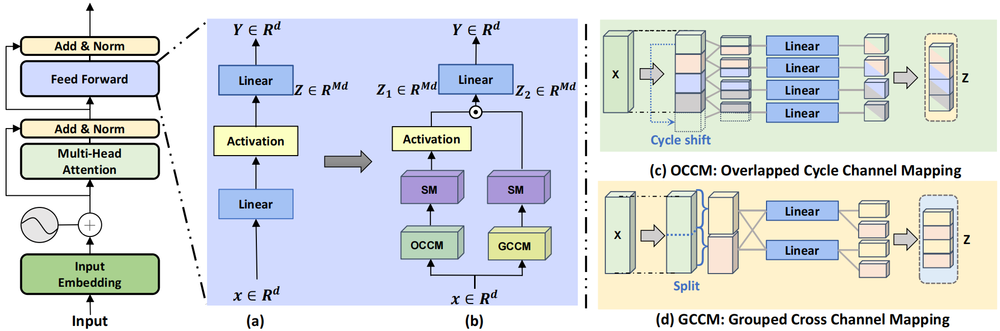

# Asymmetric Factorized Bilinear Operation for Vision Transformer
- 🌟The paper is accepted by ***ICLR 2025***.
## Abstract
As a core component of Transformer-like deep architectures, a feed-forward network (FFN) for channel mixing is responsible for learning features of each token. Recent works show channel mixing can be enhanced by increasing computational burden or can be slimmed at the sacrifice of performance. Although some efforts have been made, existing works are still struggling to solve the paradox of performance and complexity trade-offs. In this paper, we propose an Asymmetric Factorized Bilinear Operation (AFBO) to replace FFN of vision transformer (ViT), which attempts to efficiently explore rich statistics of token features for achieving better performance and complexity trade-off. Specifically, our AFBO computes second-order statistics via a spatial-channel factorized bilinear operation for feature learning, which replaces a simple linear projection in FFN and enhances the feature learning ability of ViT by modeling second-order correlation among token features. Furthermore, our AFBO presents two structured-sparsity channel mapping strategies, namely Grouped Cross Channel Mapping (GCCM) and Overlapped Cycle Channel Mapping (OCCM). They decompose bilinear operation into grouped channel features by considering information interaction between groups, significantly reducing computational complexity while guaranteeing model performance. Finally, our AFBO is built with GCCM and OCCM in an asymmetric way, aiming to achieve a better trade-off. Note that our AFBO is model-agnostic, which can be flexibly integrated with existing ViTs. Experiments are conducted with twenty ViTs on various tasks, and the results show our AFBO is superior to its counterparts while improving existing ViTs in terms of generalization and robustness.

  

